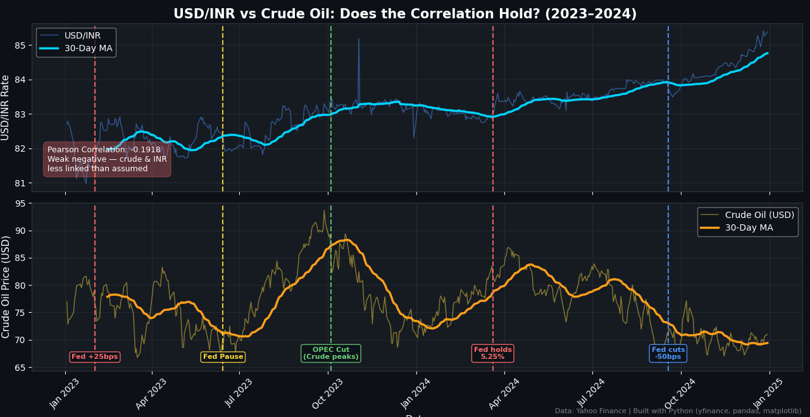

# Forex Macro Analysis: USD/INR vs Crude Oil (2023–2024)

## Overview
A Python-based analysis exploring whether crude oil prices actually drive the Indian Rupee — 
a commonly held assumption in financial markets.

## Key Finding
Pearson Correlation: **-0.1918** (Weak negative)

Despite popular belief, crude oil and USD/INR showed minimal correlation during 2023–2024. 
The Fed's rate cycle and RBI interventions had a far more visible impact on the rupee.

## Chart

## Tools Used
- Python
- yfinance
- pandas
- matplotlib

## Data Source
Yahoo Finance — 501 trading days (Jan 2023 – Dec 2024)
